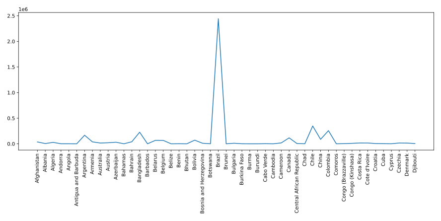

# Data Visualization
This Python data science project aims to provide a comprehensive dashboard that displays insights into the COVID-19 situation in various countries using the powerful data analysis libraries Numpy, Pandas, and Tkinter. The dashboard presents vital information such as the number of confirmed cases, deaths, and recoveries in different countries, including trends and comparisons between countries.

### Installation
1. Clone the repository by running the command below in your command prompt or terminal:
```bash
https://github.com/Vpadia717/Data_Visualization.git
```
2. Install the necessary packages:

* Install Python from [here](https://www.python.org/downloads/).
* Install Numpy by running `pip install numpy` in your command prompt or terminal.
* Install Pandas by running `pip install pandas` in your command prompt or terminal.
* Install Tkinter by following the instructions [here](https://www.tutorialspoint.com/how-to-install-tkinter-in-python)

### Usage
1. Run the `covid.py` file by running the command below in your command prompt or terminal:
```
python covid.py
```
2. The `covid.py` file will generate 5 images based on the dataset and redirect you to `scroll.py`.
3. The `dashboard.py` displays detailed data for specific countries or time frames.

### Sample Code
1. Below is an example of how to plot confirmed cases and deaths by country using a line plot with a figure size of (30,5):
```python
# Save the plot as png image 'img1.png'
plt.ioff()
plt.savefig('img1.png', bbox_inches='tight', pad_inches=0.2, format='png')

# Plot confirmed cases and deaths by country using line plot with figure size of (30,5)
plt.figure(figsize=(30, 5))
plt.xticks(rotation=90)
plt.plot(df.Country, df.Confirmed.values)
plt.plot(df.Country, df.Deaths.values)
```

The output for the code will generate a plot of confirmed cases and deaths by country, as shown below:
<br/>

### References
This README file is for the Data Visualization repository created by `Vivek Padia`. For more information on this project, please refer to the original repository [here](https://github.com/Vpadia717/Data_Visualization).

For further learning, we recommend checking out the following Python for Data Science tutorial playlist:

<a href="https://youtu.be/LEgFU4odSZc" target="_blank"></a>
